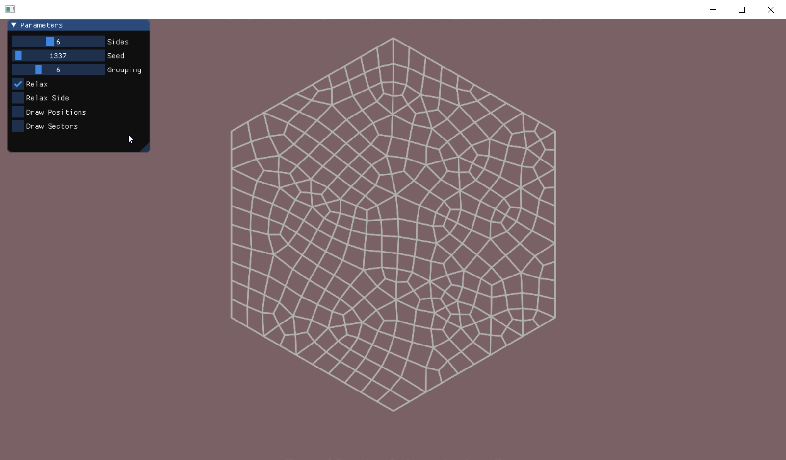
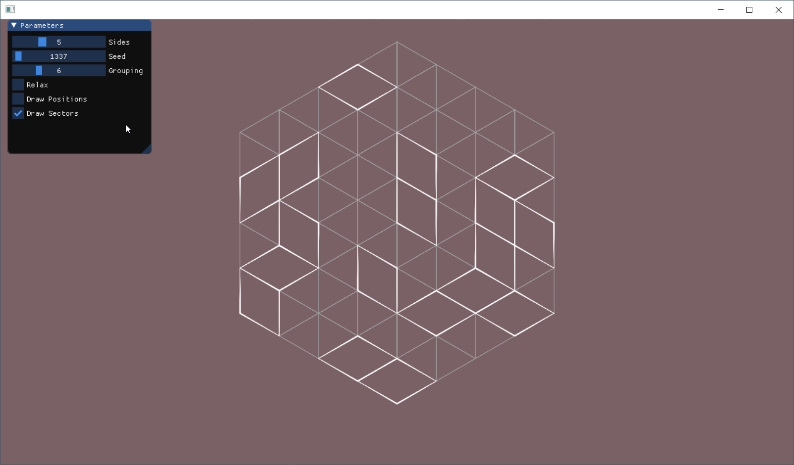
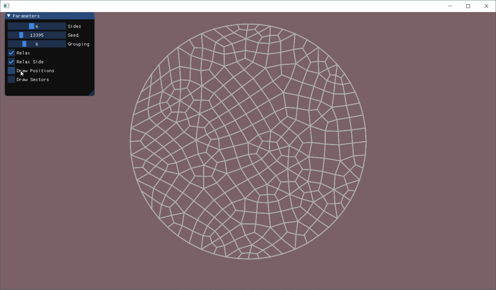

# HexagridRelaxing
hexagonal grid relaxing

I love some much Oskar Stålberg's hexagonal grid generation that I had to code it.
Here is a C++ version with Visual Studio project.
Rendering and UI is done with dear imgui.

